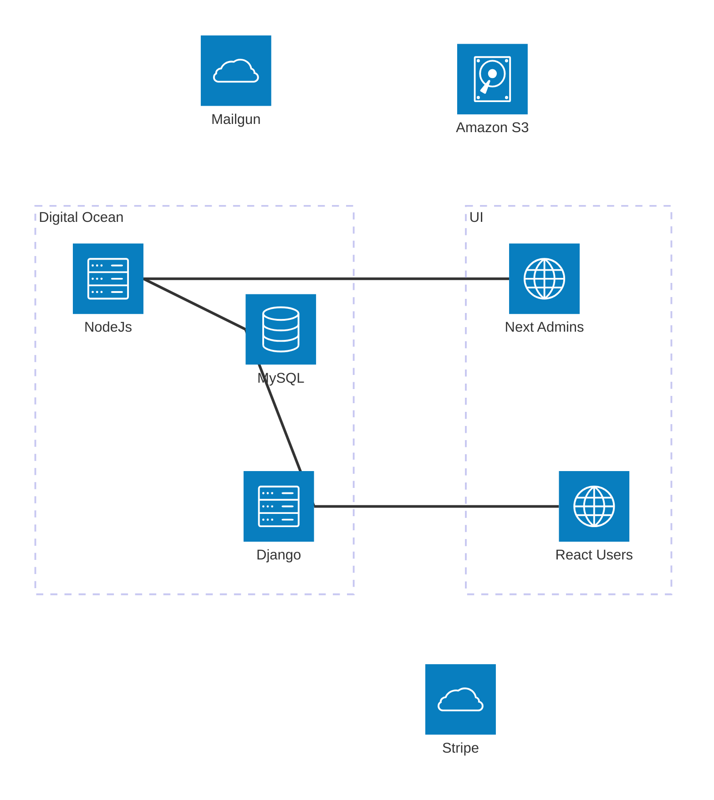

# BHMC Frontend

React frontend for [bhmc.org](https://bhmc.org) - Bunker Hill Men's Club golf management system.

## Tech Stack

- React 19 + TypeScript + Vite
- TanStack Query, React Hook Form, Zod
- Bootstrap 5 + SCSS
- Stripe payments
- Vitest + React Testing Library + MSW

## Quick Start

```bash
npm install        # Install dependencies
npm run dev        # Dev server on port 3000
npm run build      # Production build
npm run test       # Run tests
npm run lint       # ESLint check
npm run format:fix # Prettier auto-fix
```

## Environment Variables

Create `.env.local`:

```env
VITE_API_URL=http://localhost:8000/api
VITE_STRIPE_PUBLIC_KEY=pk_test_...
VITE_GIPHY_API_KEY=...
```

## Project Structure

```
src/
├── components/    # Reusable UI components
├── screens/       # Page-level route components
├── hooks/         # Custom React hooks
├── models/        # TypeScript types + Zod schemas
├── context/       # Auth, registration, layout state
├── forms/         # Form handlers + views
├── layout/        # Main, auth, admin layouts
└── utils/         # API client, date utils, config
```

## Key Features

- Event calendar & registration (multi-step flow)
- Member accounts & player directory
- Stripe payment processing
- Scoring, standings, match play tracking
- Photo gallery & club news

## Architecture

This is the "React Users" service in the diagram below


